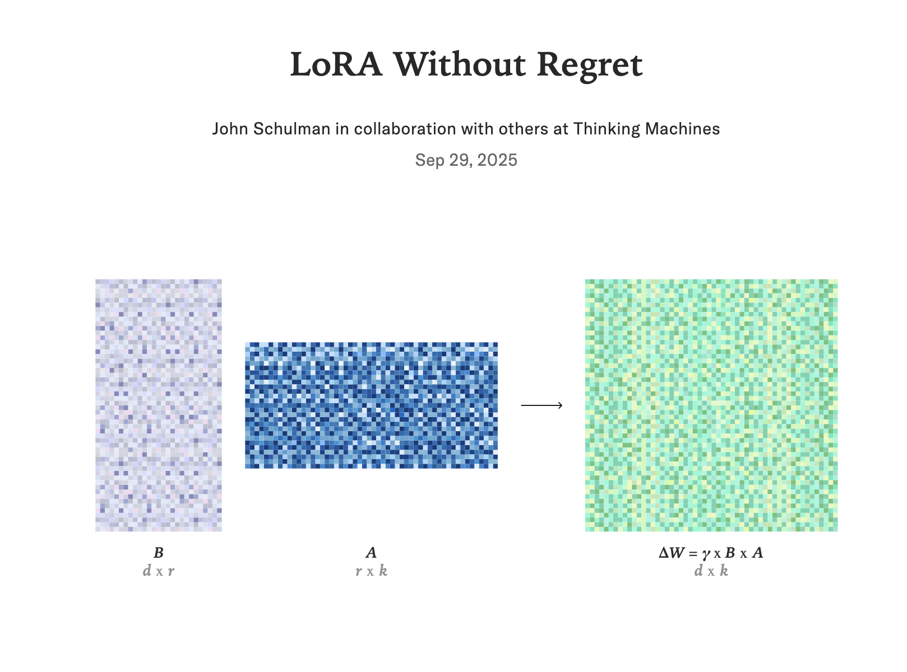

# Exploring LoRA: Efficient Fine-Tuning for Large Language Models

**Summary:**  
A deep dive into LoRA (Low-Rank Adaptation) and how it enables efficient, task-specific fine-tuning of large language models without massive compute or storage costs.

---

Recently, I finished reading the research paper **LoRA: Low-Rank Adaptation of Large Language Models** to learn how to refine and tune generative pre-trained transformers.

**LoRA** is a method that enables lightweight fine-tuning of large language models via low-rank adapters.

Here are the coolest insights I gained from the paper:

1. **Lightweight Adapters:** LoRA allows us to train lightweight adapters for large language models. For example, with GPT-3 (350GB), training 100 different LoRA adapters increases storage only to 354GB instead of 35TB.
2. **Low Intrinsic Dimension:** Pre-trained language models have a low intrinsic dimension, meaning they can learn efficiently even when projected into a much smaller subspace.
3. **Efficient Fine-Tuning:** LoRA freezes the original model weights and updates only the low-rank matrices, making fine-tuning cheaper, faster, and more memory-efficient.
4. **Task Specialization:** This approach enables task-specific adaptation without duplicating massive models, allowing quick swapping between adapters.
5. **Strong Performance:** On benchmarks like GLUE, WikiSQL, and SAMSum, LoRA performs comparably to full fine-tuning while drastically reducing compute and storage requirements.

I’m excited to experiment with these ideas in the future — from creating smaller, task-specific adapters to exploring how efficient fine-tuning techniques like LoRA can make cutting-edge AI models more practical, scalable, and accessible.

Next, I’m starting to read a recent paper published by Thinking Machines Lab titled *“LoRA Without Regret”* ([Thinking Machines Lab, 2025](https://thinkingmachines.ai/blog/lora/)) to learn how to tune hyperparameters when refining large language models with LoRA.

